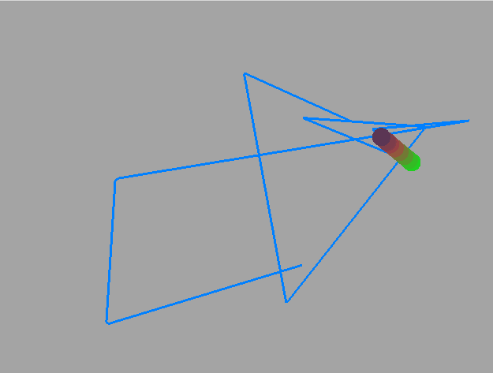

# Auria

Auria is a musical interface, time-scrubbing phase vocoder, and multieffects processor.

Auria is written C/C++ using OpenGL, RTAudio, Soundpipe, and Sporth. 

Auria is built to explore the three ways musicians interface with computers:

- Peripherals: The core interface of Auria is the F310 Logitech Gamepad, 
a robust, low-cost controller. 

- Code: At some point or another, a sound designer will have an sonic idea that just isn't
possible with pre-made synthesizers. When the knob fails, this is a good time to turn to 
some form of code. Auria is built on top of Sporth audio programming language, which allows the 
user to create and tweak any sound they'd like. Sporth code can be recompiled on-the-fly, allowing 
for seamless experimentation of ideas. 

- Live input: Using JACK audio, live input (vocals, guitars, and ukuleles) can processed through Auria. 

# Compilation

Auria needs GLUT/OpenGL, Soundpipe, and Sporth. 

After you have met these dependencies, simply run 'make' in the top level directory.

# Running a trivial example

To try out Auria, run this command:

./auria space.sp

Hit "A" (the green button), and move around with the left joystick. When you move,
you will create a blue path. Up/Down on the right joystick will cause.  

Hitting "A" again will go into "freeze" mode. Use the up/down of the joystick to navigate
through the path you drew and scrub through time. 

# Running a less trivial example

Run the file "ambient.sp" to see a more compositional patch:

./auria ambient.sp

In this instance, there is no joystick control, but there is live input. 

Here are the controls:

'A': Toggles between freeze mode and Sporth mode.

'B': fade in/out

'X': Toggles duplex mode. Enable this in Sporth mode to get Sporth code to run in Freeze mode.

'Left Button': triggers an FM drone.

'Left Joystick': When duplex mode ('X') is disabled, you can scrub through audio in Freeze mode.
